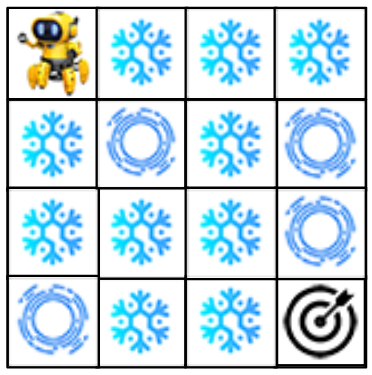
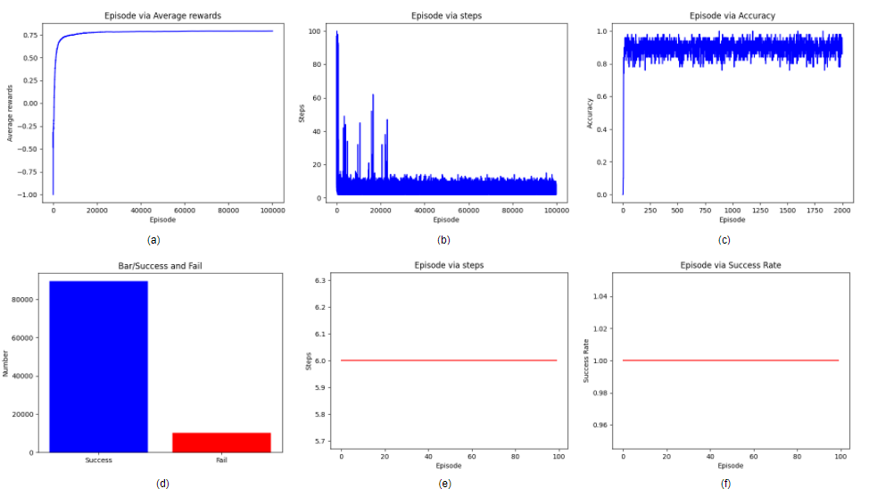
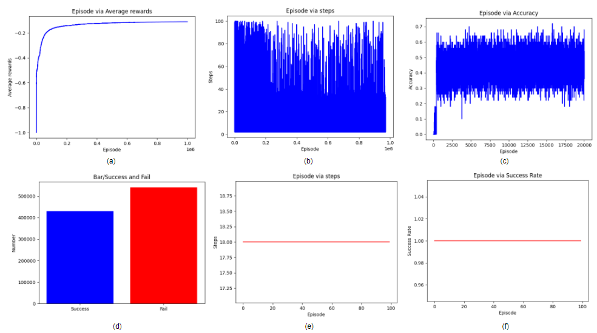
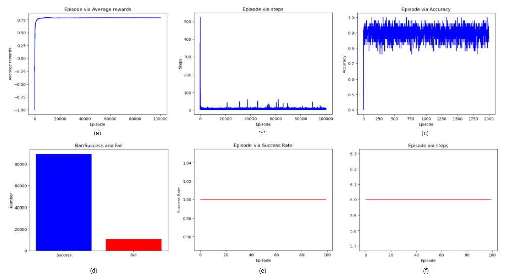
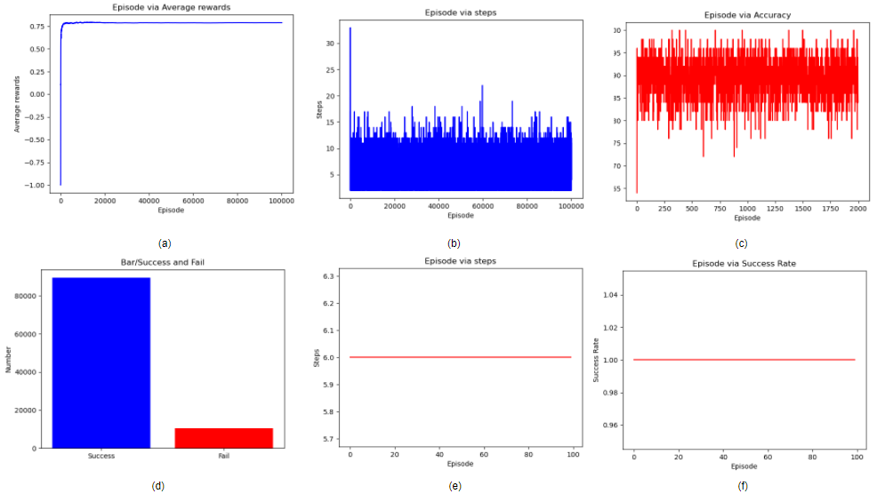
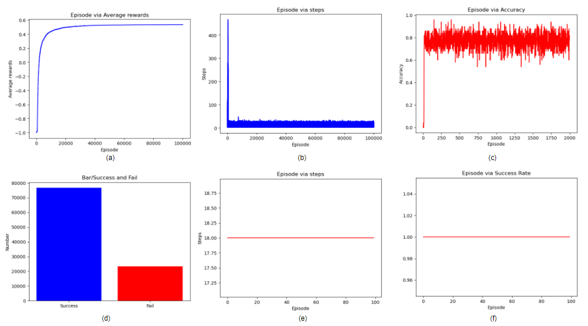
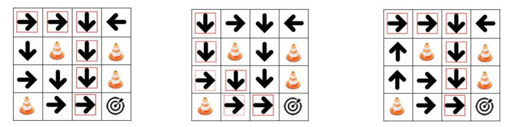
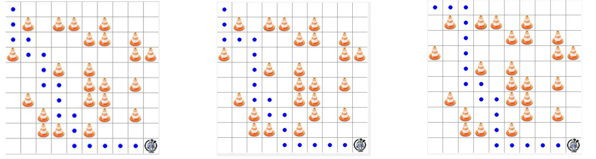
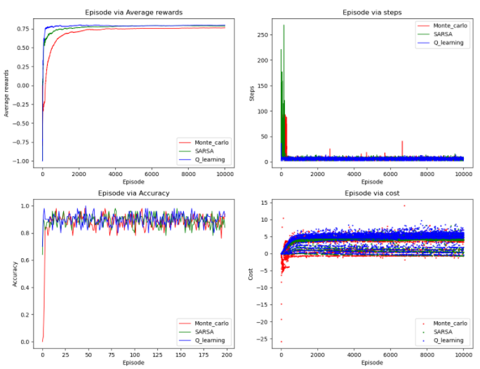
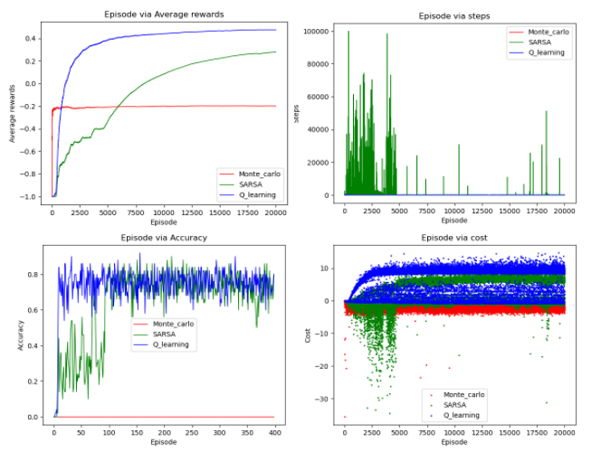

# ME5406 Course Project for Part I
This is a repository which contains simple implementations for ME5406 Deep learning for robotics 

## Problem description
Consider a RL based robot is in a grid frozen lake environment, where the goal of the robot is to pick up the target while avoid falling into the ice holes



## RL algorithm
1. First visit monte carlo
2. SARSA
3. Q-learning

## Requirements
* numpy
* matplotlib
* tkinter
* PIL

## Usage
### Train
Need to define the RL agent type ('mc'/'sarsa'/'ql'), the grid world size (4/10), the number of training epochs.

For example, if you want to train q-learning with 4x4 grid world with 10000 epochs, then you could use
```
python train.py --agent 'lq' --grid_size 4 --num_epoch 10000
```

### Test
Need to define the test type, which can be described as below
* Job 0: 4x4 frozen lake environment training, correctness test, and comparison test among algorithms
* Job 1, 10X10 frozen lake environment training, correctness test, and comparison test among algorithms
* Job 2, comparison test for different learning rate value settings
* Job 3, comparison test for different gamma value settings
* Job 4, comparison test for different epsilon value settings

If you want to test with Job 0, you could use
```
python train.py --job 0 --num_epoch 10000
```

### Training Results
* First visit Monte Carlo
  * 4x4 grid world
    
  * 10x10 grid world
    
* SARSA
  * 4x4 grid world
    
  * 10x10 grid world
    
* Q-learning
  * 4x4 grid world
    
  * 10x10 grid world
    
    
* Final policy
  * 4x4 grid world
    From left to right: Monte Carlo, SARSA, Q-learning
    
    
  * 10x10 grid world
    From left to right: Monte Carlo, SARSA, Q-learning
    
    
### Testing Results
* Algorithm comparisons
    * 4x4 grid world
      
    * 10x10 grid world
      
      
* Learning rate
  Red/0.01, Green/0.001, Blue/0.0001
  
* Gamma
  Red/0.8, Green/0.9, Blue/0.99
  
* Epsilon
  Red/0.7, Green/0.8, Blue/0.9

Note: I didn't put all the plots here, but you can find all of them in the ./Results file

### Reference
Morvan Zhou

### Acknowledgement
Don't forget to give me a star if you like this! :blush: